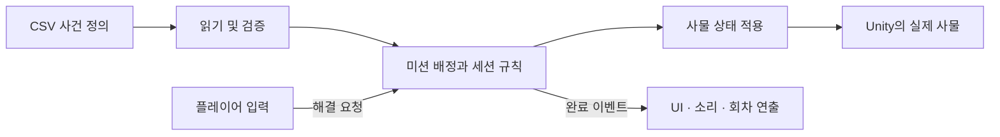
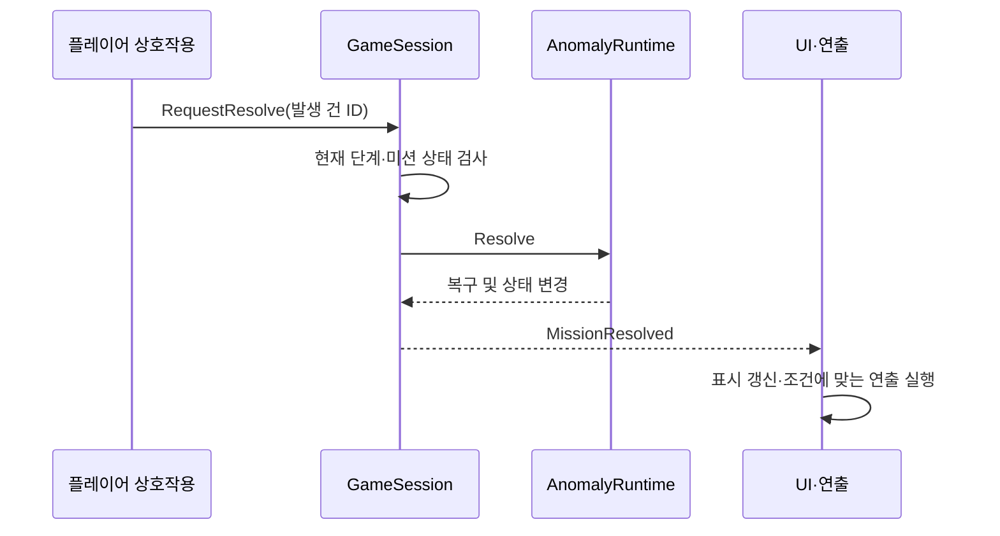

# REC — 게임 경험을 구현한 프로그래밍 기법과 설계

> 외부 설명용 기술 문서 · 2026-09-28 코드 기준
>
> Unity를 잘 모르는 독자도 이해할 수 있도록, 실제 게임에서 생기는 문제와 이를 해결한 구조를 연결해 설명합니다. 실행·Inspector 설정·데이터 변경 절차는 [내부 README](../README.md)에 정리되어 있습니다.

## 1. 어떤 게임이며, 무엇이 어려웠는가

REC는 CCTV로 이상현상을 살피고 현장에서 사물을 복구하는 3D 공포 게임입니다. 플레이어는 여러 회차를 진행하며, 사라진 사물·추가된 사물·움직인 사물 등을 찾아 해결합니다. 사건 해결 뒤에는 냉장고 문이 열리거나, 귀신이 나타나거나, 복도가 어두워지는 연출이 이어집니다. 마지막 회차의 모든 배정 미션을 해결하면 영상을 재생하고 타이틀로 돌아갑니다.

구현에서 중요한 문제는 단순히 “문을 회전시키는 법”에 그치지 않았습니다.

- 같은 사물에도 서로 다른 이상현상이 적용될 수 있습니다.
- 기획자가 미션 시각이나 대상을 바꿔도 게임 규칙을 매번 다시 작성하고 싶지는 않습니다.
- 복구 성공 하나가 소리, 하이라이트, 진행 상태, 공포 연출에 동시에 영향을 줍니다.
- 회차를 다시 시작할 때 문·귀신·소리·조작 제한까지 일관되게 초기화해야 합니다.
- CCTV, 일시정지, 귀신 연출이 겹칠 때 서로의 상태를 잘못 해제하면 안 됩니다.

이 프로젝트는 **무엇이 일어나는지 결정하는 규칙**과 **그 결과를 보여주고 들려주는 표현**을 분리하여 이 문제를 다룹니다.

## 2. 전체 구조: 정의 → 판단 → 표현



CSV는 “어떤 사건이 언제 일어나는가”를 기록합니다. 세션은 “지금 해결해도 되는가, 회차가 끝났는가”를 판단합니다. Unity 컴포넌트는 “모델을 숨기고, 소리를 끄고, 문을 움직이는 일”을 수행합니다.

| 층 | 쉬운 설명 | 실제 구현 예 |
|---|---|---|
| 정의 데이터 | 사건의 설계표 | QuestData, AnomalyData, TargetCodeData |
| 실행 상태 | 이번 플레이의 진행 기록 | MissionRuntime, GameSession |
| 규칙 | 행동이 가능한지 판단하는 부분 | MissionPlanner, GameSession |
| 엔진 연결 | 규칙을 실제 사물 조작으로 바꾸는 부분 | AnomalyTargetAdapter |
| 표현 | 화면과 소리로 결과를 전달하는 부분 | PresentationEffect, 회차별 Presentation, Audio 컴포넌트 |

이 분리는 폴더 이름만 나눈 것이 아닙니다. 코어는 Transform을 직접 찾기보다 인터페이스와 ID를 사용하고, Unity 쪽에서 필요한 객체를 연결합니다. 데이터 로딩 계층 등에는 Unity 관련 참조가 있으므로 프로젝트 전체가 엔진과 완전히 독립적이라고 주장하지는 않습니다.

## 3. 데이터 기반 설계: 사건의 내용과 실행 코드를 분리하기

**데이터 기반 설계**는 대상·시간·확률 같은 내용을 코드의 조건문 대신 데이터로 표현하는 방법입니다.

예를 들어 “1회차 01:30에 영안실 꽃병 사건”은 현재 Quest 4에 정의되어 있습니다. 테이블은 다른 테이블의 ID를 통해 사건 종류, 사물, 이동 설정으로 연결됩니다.

```text
Quest: 언제, 어느 회차에 배정할 것인가
  → Anomaly: 어떤 이상현상인가
    → Detail: 어느 대상에 어떤 설정을 적용하는가
      → TargetCodes: 실제 맵의 어느 사물인가
      → MovementParameter: 이동이라면 어느 축으로 얼마나 움직이는가
```

이 구조에서는 기존 행동을 사용하는 사건을 추가할 때 공통 실행 코드를 재사용할 수 있습니다. 새로운 행동 종류라면 데이터만 추가하는 것으로 끝나지 않고, 대응 전략과 어댑터 지원도 필요합니다.

### 잘못된 데이터는 언제 잡는가

CSVParser가 셀을 읽고, CsvMapper가 C# 데이터 형식으로 바꾸며, DataManager와 GameDataValidator가 ID 중복·필수 값·범위·다른 테이블 참조를 검사합니다. 검증이 끝나기 전에는 실행용 저장소를 공개하지 않습니다.

이 방식은 “플레이 중 문이 안 열린다”보다 “어느 데이터 연결이 잘못됐는가”를 앞 단계에서 찾도록 돕습니다. 다만 씬 오브젝트 존재 여부와 Collider 배치까지 CSV 검증만으로 보장되지는 않습니다.

### 재사용한 C# 기법

`GetData<QuestData>(id)`처럼 제네릭을 사용해 테이블마다 조회 코드를 반복하지 않습니다. 내부에서는 타입별 Dictionary와 ID별 Dictionary로 조회합니다. `Seal()`은 초기화 후 테이블 추가를 막지만, 데이터 객체 자체를 깊은 불변 객체로 바꾸지는 않습니다.

관련 코드: [DataManager](../Assets/3.Script/Data/Loading/DataManager.cs), [GameDataValidator](../Assets/3.Script/Data/Validation/GameDataValidator.cs)

## 4. 객체지향과 Strategy: 다른 이상현상을 같은 방식으로 실행하기

사물을 숨기는 행동과 움직이는 행동은 실제 구현이 다릅니다. 그러나 실행기 입장에서는 둘 다 “대상에게 이상현상을 적용한다”는 공통 작업입니다.

이 공통 계약을 추상 클래스 `AnomalyAction`의 `Apply`로 표현합니다.

```csharp
// 실제 구조를 설명하기 위해 핵심만 발췌한 코드
public abstract void Apply(IAnomalyBody body, MovementSpec movement);
```

- VisibilityAction은 보임/숨김을 바꿉니다.
- MovementAction은 위치·회전 관련 동작을 요청합니다.
- ShadowAction은 그림자 표시를 요청합니다.
- ReplacementAction은 교체 표현을 요청합니다.

실행기는 등록된 행동을 찾아 같은 `Apply` 호출을 사용합니다. 객체의 실제 종류에 따라 다른 처리가 실행되는 것이 **다형성**입니다.

**Strategy 패턴**은 바꿔 끼울 수 있는 행동을 별도 객체로 분리하는 방식입니다. REC에서는 행동별 코드를 분리하고 ActionCatalog에 이름으로 등록하여, 사건 실행부에 이상현상별 분기를 계속 늘리지 않도록 했습니다. 상속은 공통 계약을 표현하고, 실행기는 그 전략 객체를 조합하여 사용합니다.

이름을 등록한다고 임의의 메서드를 실행하는 것은 아닙니다. 등록된 행동과 발생/해결 이름 쌍을 검증합니다. 새 행동은 구현·등록·데이터 정의가 함께 맞아야 합니다.

관련 코드: [AnomalyStrategies](../Assets/3.Script/InGame/Core/AnomalyStrategies.cs)

## 5. Adapter와 의존성 주입: 게임 규칙이 Unity 사물을 몰라도 되게 하기

규칙 코드가 직접 GameObject를 찾아 켜고 끄면, 대상 구조가 달라질 때 규칙 코드까지 바뀝니다. 또한 Unity를 실행하지 않는 규칙 검사가 어려워집니다.

`IAnomalyBody`는 “보이게 하라”, “이동하라”, “기준 상태로 복구하라”는 기능을 정의합니다. `AnomalyTargetAdapter`가 이 요청을 실제 Transform·Visual·상호작용 상태에 연결합니다.

이처럼 서로 다른 인터페이스 사이를 연결하는 역할이 **Adapter 패턴**입니다. 번역기에 비유하면, 코어가 말하는 “복구”를 Unity 객체가 이해하는 위치·회전·활성 상태 변경으로 번역합니다.

필요한 저장소·난수·어댑터는 Bootstrapper와 Host가 만들어 전달합니다. 이를 **의존성 주입**이라고 합니다. 별도 프레임워크 없이 생성자와 Configure 메서드로 연결합니다.

그 결과 검증 도구에서는 실제 문 대신 계약만 구현한 대체 객체를 전달해 “해결하면 어떤 상태가 되는가”를 검사할 수 있습니다. 모델 배치나 영상 출력까지 대체 객체로 검증되는 것은 아닙니다.

관련 코드: [계약](../Assets/3.Script/InGame/Core/SessionContracts.cs), [AnomalyTargetAdapter](../Assets/3.Script/InGame/Session/AnomalyTargetAdapter.cs), [InGameSceneBootstrapper](../Assets/3.Script/InGame/Session/InGameSceneBootstrapper.cs)

## 6. Observer: 복구 성공 하나를 여러 기능에 알리기

꽃병을 해결했을 때 플레이어 입력 코드가 냉장고 문, 사운드, HUD를 모두 직접 호출하면 의존 관계가 복잡해집니다.

REC는 먼저 해결 요청을 세션에 전달하고, 실제 상태가 변경된 다음 `MissionResolved` 이벤트를 보냅니다. 각 기능은 필요한 이벤트를 구독합니다. 이것이 **Observer 패턴의 이벤트 기반 적용**입니다.



**요청과 완료 알림은 다릅니다.** 버튼을 눌렀다는 사실만으로 성공 소리를 내거나 다음 회차로 넘어가지 않습니다. 허용된 요청이 처리된 뒤 결과를 알립니다.

문 소리에도 같은 원리를 적용합니다. DoorInteraction이 실제 열림/닫힘을 시작한 뒤 MotionStarted를 보내면 DoorAudioPlayer가 음원을 선택합니다. 문을 초기화할 때는 취소 이벤트로 소리를 끕니다.

구독한 객체는 종료 시 구독을 해제해야 합니다. 그렇지 않으면 이미 사라진 객체에 알림이 가거나 중복 호출될 수 있습니다. 이 프로젝트는 기능 간 C# 이벤트를 사용하며, 모든 통신을 하나의 전역 이벤트 버스에 몰아넣지는 않습니다.

관련 코드: [GameSessionHost](../Assets/3.Script/InGame/Session/GameSessionHost.cs), [DoorInteraction](../Assets/3.Script/InGame/Session/DoorInteraction.cs), [DoorAudioPlayer](../Assets/3.Script/Audio/DoorAudioPlayer.cs)

## 7. 상태 머신: 지금 할 수 있는 행동을 명확히 하기

CCTV 확인 전과 현장 순찰 중에는 허용되는 행동이 다릅니다. 이를 여러 bool만으로 처리하면 “순찰 중인데 동시에 엔딩 상태” 같은 모순을 만들기 쉽습니다.

GameSession은 SessionPhase와 전환 조건으로 진행을 관리합니다.

```text
초기 순찰 → CCTV실 → 이상현상 순찰
  ├─ 일반 회차 전체 해결 → 최종 복귀 → 회차 완료
  └─ 마지막 회차 전체 해결 → 엔딩 → 완료
미해결 상태로 마감 도달 → 게임오버
```

엔딩 상태에서는 시간이 더 흘러 게임오버가 발생하거나, 다른 회차로 건너뛰는 요청이 처리되지 않도록 제한합니다. 영상 완료도 해당 상태에서만 받아 중복 완료를 막습니다.

회차 연출 역시 Dormant, Armed, Blinking, Rushing 같은 상태를 사용합니다. 3회차에서는 사건을 해결하기 전에는 복도에 들어가도 돌진 연출이 시작되지 않습니다.

이는 **명시적 상태 머신**입니다. 상태마다 별도의 클래스를 만들어 교체하는 고전적인 State 패턴 전체를 적용한 구조는 아닙니다. 현재 규모에서는 열거형과 전환 조건을 통해 진행을 한눈에 확인할 수 있도록 했습니다.

관련 코드: [GameSession](../Assets/3.Script/InGame/Core/GameSession.cs), [RoundThreePresentation](../Assets/3.Script/InGame/Presentation/RoundThreePresentation.cs)

## 8. Template Method: 연출마다 반복되는 수명 관리 통일하기

문 열기와 화면 노이즈는 표현은 다르지만, 시작·시간 진행·일시정지·종료·회차 초기화가 모두 필요합니다.

`PresentationEffect`는 공통 흐름인 Play, Tick, StopImmediately를 제공하고, 세부 동작은 자식 클래스의 OnStarted, OnTick, OnStopped에서 구현하도록 합니다.

이 구조는 **Template Method 패턴**입니다. 부모가 작업 순서를 정하고, 자식이 단계별 내용을 채웁니다. DoorOpenPresentation은 문 회전과 소리를, ScreenNoiseEffect는 화면 노이즈를 구현합니다.

PresentationDirector는 이벤트가 조건과 맞는지 검사하고, 해당 회차에 이미 실행한 효과를 다시 실행하지 않도록 관리합니다. 회차가 시작되면 실행 기록을 초기화합니다.

모든 연출이 이 상속 구조를 사용하는 것은 아닙니다. 복잡한 2~4회차 연출은 별도의 상태 진행과 공통 Actor·Trigger·화면 도우미를 조합합니다. 공통성이 있는 부분만 상속으로 묶고 나머지는 조합하는 선택입니다.

관련 코드: [PresentationEffect](../Assets/3.Script/InGame/Presentation/PresentationEffect.cs), [PresentationDirector](../Assets/3.Script/InGame/Presentation/PresentationDirector.cs)

## 9. MVC와 탐색 인터페이스: 버튼과 씬 이동 분리하기

메뉴에서는 Model이 메뉴 상태, View가 표시, Controller가 사용자의 요청 처리를 맡습니다. Controller는 직접 SceneManager를 호출하기보다 IMenuNavigation을 사용합니다. 실제 Unity 씬 이동은 MenuNavigation이 수행합니다.

따라서 버튼 디자인이나 패널 구조가 바뀌어도 게임 시작 요청의 책임을 유지할 수 있습니다. StoryMenuEntryPoint는 카드형 메뉴에서 기존 시작 로직으로 연결하는 입구 역할을 합니다.

이것은 메뉴·결과 화면에 적용한 **MVC식 책임 분리**입니다. 프로젝트 전체를 MVC 하나로 설명하지는 않습니다. 인게임은 세션 규칙·어댑터·표현으로 더 세분화되어 있습니다.

관련 코드: [MenuController](../Assets/3.Script/OutGame/StartMenu/MenuController.cs), [IMenuNavigation](../Assets/3.Script/OutGame/StartMenu/IMenuNavigation.cs), [StoryMenuEntryPoint](../Assets/3.Script/OutGame/StartMenu/StoryMenuEntryPoint.cs)

## 10. 중첩 사건과 초기화: 단순한 반대 동작보다 기준 상태 복구

같은 사물에 “움직임”과 “사라짐”이 동시에 걸렸다고 가정해 보겠습니다. 사라짐을 해결하면서 모든 상태를 정상으로 되돌리면 아직 해결하지 않은 움직임까지 없어집니다.

AnomalyRuntime은 기준 상태를 복구한 뒤 남아 있는 활성 사건을 순서대로 다시 적용합니다. 현재 구현은 별칭 ID와 부모/자식 대상의 영향을 고려해 등록된 대상 전체를 복구하고 활성 사건을 재적용합니다. 이 작업은 매 프레임이 아니라 사건 전환 시 실행됩니다.

- **Target ID:** 어떤 사물인가.
- **Quest ID:** 어떤 미션 정의인가.
- **Occurrence ID:** 이번 실행에서 발생한 어느 사건인가.

세 ID를 구분해야 같은 사물의 사건과 중복 해결을 정확히 다룰 수 있습니다.

회차 초기화는 RoundResetScope가 위치·회전·크기·활성 상태를 저장하고 복원합니다. 문처럼 내부 상태가 있는 객체는 IRoundResetParticipant로 별도 초기화를 수행합니다. 스냅샷 복구 아이디어를 사용하지만, 실행 기록 전체를 저장하는 Event Sourcing이나 완전한 저장/불러오기 시스템은 아닙니다.

관련 코드: [AnomalyRuntime](../Assets/3.Script/InGame/Core/AnomalyStrategies.cs), [RoundResetScope](../Assets/3.Script/InGame/Session/RoundResetScope.cs)

## 11. 시간·난수·단위: 재현 가능한 규칙 만들기

게임 시계는 기본적으로 실제 2.5초를 게임 1분으로 환산합니다. 코어는 경과 밀리초를 받고, Unity Host가 프레임 시간을 누적합니다. 따라서 검사 도구는 실제로 몇 분을 기다리지 않고 원하는 시간까지 Tick을 진행할 수 있습니다.

4회차 03:30 연출은 시각이 정확히 일치하는 순간만 검사하지 않습니다. 회차 시작 시각에서 자정을 넘어 목표 시각까지의 경과 시간을 계산하여, 시간 건너뛰기로 03:30을 지나도 활성화할 수 있습니다.

미션 배정에는 외부에서 주입한 IRandomSource를 사용합니다. 일정별 후보의 가중치로 선택하고, 선택한 항목을 후보에서 제거하여 같은 일정 내 중복 추첨을 막습니다. 예를 들어 가중치 1과 3은 해당 선택 시 상대적으로 1:3의 비중을 뜻하며, 여러 번 비복원 추첨한 최종 포함 확률과 동일한 의미는 아닙니다.

이동 값은 단위를 변환하여 사용합니다. 50cm는 Unity 0.5m이며, 이동 단위가 비어 있으면 현재 구현에서는 cm로 처리합니다. 회전은 Degree를 사용합니다.

시드·정수 시간·정렬 순서는 규칙 재현에 도움이 되지만, Unity 물리와 부동소수점·입력 순서까지 포함한 플랫폼 간 결정론을 보장하지는 않습니다.

관련 코드: [MissionPlanner](../Assets/3.Script/InGame/Core/MissionPlanner.cs), [SessionContracts](../Assets/3.Script/InGame/Core/SessionContracts.cs)

## 12. 오디오와 입력 제한: 여러 조건의 충돌 방지

### 실제 이동을 판정하는 발소리

키를 눌렀다는 사실과 실제 이동은 다릅니다. PlayerController는 CharacterController.Move 전후 수평 변위를 비교하고, PlayerFootstepAudio는 LateUpdate에서 해당 프레임의 결과를 읽습니다. 벽에 막힌 이동이나 순간이동을 걷기로 오인하는 것을 줄입니다.

### 서로 다른 이유로 멈추는 환경음

CCTV 확인은 Pause/UnPause로, 4회차 심장박동은 mute와 원래 상태 복구로 처리합니다. 새 환경음 재생기가 mute까지 매번 덮어쓰지 않으므로 CCTV 시점 복귀가 심장박동 중 음소거까지 해제하지 않습니다. 현재 두 제어 책임을 분리한 방식이며, 모든 종류의 오디오 차단을 처리하는 범용 믹서 시스템은 아닙니다.

### 입력 잠금의 소유자

귀신 연출과 엔딩이 동시에 조작을 제한할 수 있습니다. PlayerController는 잠금을 요청한 소유자들을 HashSet으로 관리합니다. 한 연출이 끝나면 자신의 잠금만 제거합니다. 이것은 중복을 막는 집합과 소유권을 활용한 기법으로, 다른 연출이 유지 중인 잠금을 잘못 푸는 문제를 방지합니다.

관련 코드: [PlayerController](../Assets/3.Script/InGame/Player/PlayerController.cs), [GameAmbienceAudio](../Assets/3.Script/Audio/GameAmbienceAudio.cs), [RecoveryAudioSettings](../Assets/3.Script/Audio/RecoveryAudioSettings.cs)

## 13. Unity 기술과 자원 관리

| 기술 | 사용 목적 | 주의할 점 |
|---|---|---|
| Input System | 이동·시점·복귀 입력 구성 | 입력 허용과 게임 규칙의 허용은 별도 검사 |
| CharacterController | 플레이어 이동·충돌 | 실제 이동 결과를 발소리 판정에 사용 |
| Cinemachine / CameraManager | 플레이어·CCTV 시점 전환 | 카메라 모드 변경을 이벤트로 알림 |
| Raycast / Trigger Collider | 조준·벽 가림·복도 진입 | 감지 영역 표면과 앵커 배치가 실제 동작에 영향 |
| RaycastNonAlloc | 상호작용 감지 버퍼 재사용 | 버퍼 한계와 실제 부하 검증은 별도 필요 |
| ScriptableObject | 복구 음원 설정 에셋 | 실행 상태가 아닌 편집 가능한 설정으로 사용 |
| VideoPlayer / RenderTexture | 엔딩 영상을 UI에 표시 | 준비 실패·시간 초과 시 대체 화면, 종료 시 텍스처 해제 |
| Screen Space Overlay | 노이즈·암전·엔딩 표시 | 검은 배경으로 가리는 것과 월드 렌더링 중단은 다름 |
| 렌더링 콜백 | 카메라 흔들림을 적용 후 복원 | 플레이어가 소유한 원래 시점과 연출을 분리 |

귀신 모델과 트리거는 초기화 때 생성하고 회차마다 숨기거나 재설정하여 사용합니다. 이를 객체 재사용이라고 설명할 수 있지만, 범용 대여·반납 관리자를 갖춘 Object Pool 패턴을 완성했다고 보지는 않습니다.

초기화 시 맵 검색을 모으고 매 프레임의 생성·검색을 줄이려는 방향을 사용합니다. 다만 실제 성능 개선 수치나 목표 프레임률 달성은 프로파일링 결과 없이 주장하지 않습니다.

## 14. 검증과 확장 가능성

코어 검사에서는 실제 데이터를 읽고 대체 사물 어댑터로 배정·상태 전환·중복 완료 등을 확인합니다. 참조 컴파일은 Unity API와 C# 문법 연결을 검사합니다. 최종적으로 모델 위치·음량·트리거·영상 전환은 Unity 플레이 검증이 필요합니다.

이 문서를 작성하면서 게임을 실행하거나 새 성능 수치를 측정하지 않았습니다. 과거 검사 통과 기록은 당시 코드에 대한 기록이며, 이후 데이터와 엔딩 규칙 변경까지 자동으로 보증하지 않습니다.

확장 시 책임 경계는 다음과 같습니다.

| 확장 | 추가할 위치 |
|---|---|
| 기존 종류의 새 사건 | 데이터 행·씬 대상 연결·검증 |
| 새로운 이상현상 종류 | 행동 전략·어댑터 지원·데이터 검증 |
| 새로운 공포 연출 | 결과 이벤트 소비자·상태 진행·초기화 계약 |
| 새로운 메뉴 화면 | View와 진입점, 기존 Controller/Navigation 재사용 |
| 네트워크 플레이 | 권한 있는 세션·명령 전달·결과 동기화 계층 추가 |

네트워크, P2P, 전용 서버는 현재 구현 범위가 아닙니다. ID 기반 명령과 엔진 어댑터 분리는 확장에 도움이 되지만, 권한 판정·시간 동기화·메시지 순서·재접속 처리가 추가로 필요합니다.

## 15. 적용한 패턴을 어떻게 설명할 것인가

| 명칭 | 실제 적용 범위 |
|---|---|
| Strategy | 이상현상별 AnomalyAction 구현과 선택 |
| Observer | 세션 결과·카메라 모드·문 동작 이벤트 구독 |
| Adapter | IAnomalyBody와 Unity 사물의 연결 |
| Template Method | PresentationEffect의 공통 수명과 자식별 단계 구현 |
| MVC | 메뉴·기존 결과 화면의 상태·표시·요청 처리 분리 |
| Dependency Injection / Composition Root | 생성자·Configure와 Bootstrapper의 의존성 조립 |
| 명시적 상태 머신 | SessionPhase와 회차 연출 Stage의 전환 제어 |

ActionCatalog는 행동 **등록소**, Bootstrapper의 생성 코드는 **구성 책임**, 반복 사용 모델은 **객체 재사용**으로 설명하는 것이 정확합니다. Factory Method, Decorator, 범용 풀 등은 이름이 비슷하다는 이유로 적용 패턴 목록에 추가하지 않습니다.

REC의 기술적 특징은 패턴의 개수보다, 기획 데이터 변경·동시 사건·연출 취소·회차 재시작 같은 실제 문제에 맞게 책임을 분리한 데 있습니다. 발표에서는 “꽃병 해결 요청이 상태 변경을 거쳐 문 연출 이벤트로 이어진다”는 한 사례를 먼저 설명한 뒤, 그 안에 사용된 데이터 기반 설계·다형성·이벤트·어댑터를 연결하면 전체 구조를 전달하기 쉽습니다.
